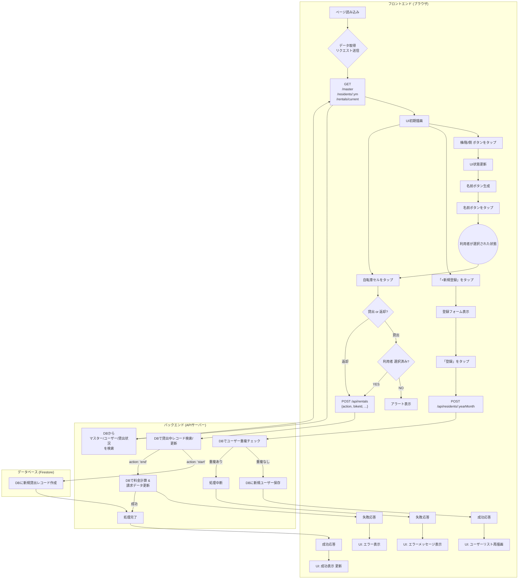

```mermaid
graph TD
    %% --- 全体構造定義 ---
    subgraph "フロントエンド (ブラウザ)"
        direction LR
        %% 初期化
        A1[ページ読み込み] --> A2{"データ取得<br>リクエスト送信"};
        A2 --> B1;
        B1 --> A3[UI初期描画];

        %% ユーザー選択
        A3 --> D1["棟/階/側 ボタンをタップ"];
        D1 --> D2[UI状態更新];
        D2 --> D3[名前ボタン生成];
        D3 --> D4["名前ボタンをタップ"];
        D4 --> D5((利用者が選択された状態));

        %% 新規登録
        A3 --> E1["「+新規登録」をタップ"];
        E1 --> E2[登録フォーム表示];
        E2 --> E3["「登録」をタップ"];
        E3 --> F1;
        F2 --> E4[UI: ユーザーリスト再描画];
        F3 --> E5[UI: エラーメッセージ表示];

        %% 貸出・返却
        D5 --> H1["自転車セルをタップ"];
        A3 --> H1;
        H1 --> H2{貸出 or 返却?};
        H2 -- 貸出 --> H3{利用者 選択済み?};
        H3 -- NO --> H4[アラート表示];
        H3 -- YES --> I1;
        H2 -- 返却 --> I1;

        I2 --> H5[UI: 成功表示 更新];
        I3 --> H6[UI: エラー表示];
    end

    subgraph "バックエンド (APIサーバー)"
        B1["GET<br>/master<br>/residents/:ym<br>/rentals/current"];
        B1 --> C1;

        F1["POST /api/residents/:yearMonth"];
        F1 --> C2;
        C3 --> F2[成功応答];
        C4 --> F3[失敗応答];

        I1["POST /api/rentals<br>{action, bikeId, ...}"];
        I1 --> C5;
        C8 --> I2[成功応答];
        C7 --> I3[失敗応答];
    end

    subgraph "データベース (Firestore)"
        C1["DBから<br>マスター/ユーザー/貸出状況<br>を検索"];
        C1 --> B1;

        C2["DBでユーザー重複チェック"];
        C2 -- 重複なし --> C3["DBに新規ユーザー保存"];
        C2 -- 重複あり --> C4["処理中断"];

        C5["DBで貸出中レコード検索/更新"];
        C5 -- "action: 'start'" --> C6["DBに新規貸出レコード作成"];
        C5 -- "action: 'end'" --> C7["DBで料金計算 &<br>請求データ更新"];
        C6 --> C8["処理完了"];
        C7 -- 成功 --> C8;
    end
```